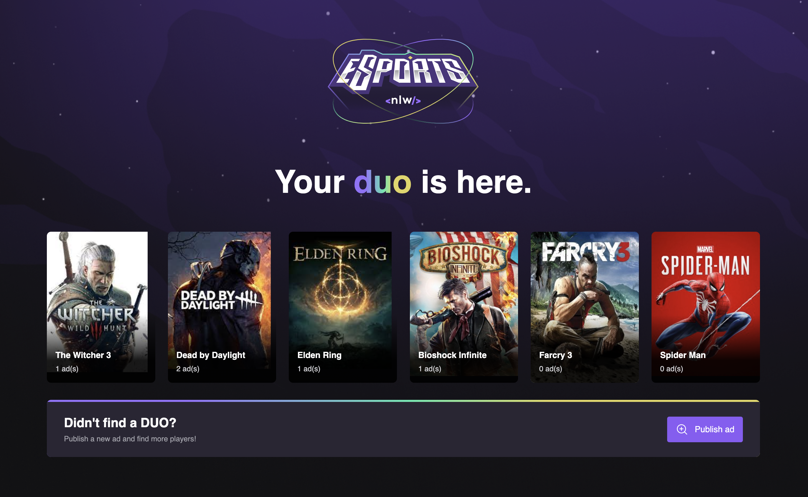

<p align="center">
   
</p>


<p align="center">
🎮 Find your best duo and have fun playing your favorite game!
</p>

---

## :rocket: Technologies
This project was made using the following technologies:

* [TypeScript](https://www.typescriptlang.org/)      
* [ReactJS](https://reactjs.org/)      
* [Vite](https://vitejs.dev/)


## :computer: How to run

```bash
# Clone repository
$ git clone https://github.com/debfdias/e-sports

# Access folder 
$ cd web
```

```bash
# Install dependencies
$ npm install

# Run aplication
$ npm run dev

```

## :framed_picture: Screenshots ##

<h1 align="center">
    
    
</h1>


## :page_facing_up: License

This project is licensed under the [MIT license](./LICENSE).